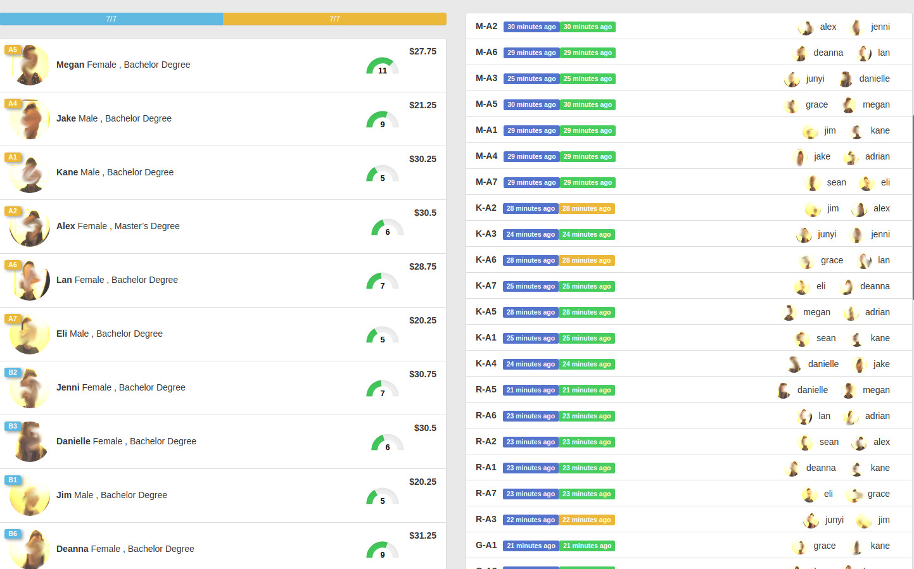
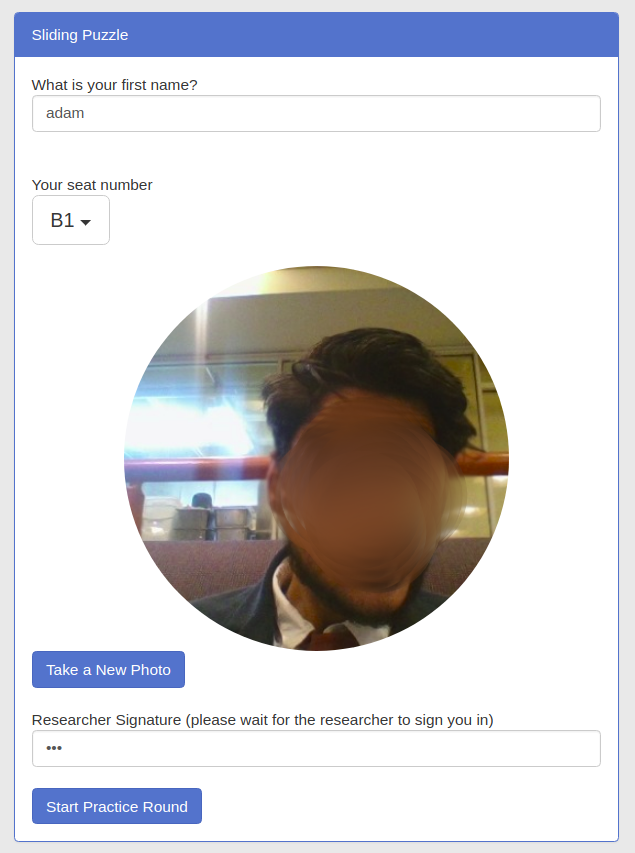

This code was written with the direction of Associate Professor Siri Isaksson for her paper [It Takes Two: Gender Differences in Group Work](https://github.com/monoklabs/Econ-Puzzle-Experiment/blob/master/it-takes-two.pdf).

# Econ-Puzzle-Experiment
A system used to implement a gender bias-, credit attribution experiment at the Harvard Decision Science Laboratory between 2017 and 2019.

The system uses a node.js backend to host a game-server, that can connect mutiple players (100+) across several rooms (A,B,C..) in a standard laboratory with some 16+ seats each. These numbers can be modified in a config.json file. The frontend is written in react.js and connects to the server through sockets. The Game is a Sliding puzzle that displays the photo of the opponent/collaborator and their first name. A time-limit for each game and the number of games can be configured as well as the board for each game can be set, multiple boards exist in the config with varying degrees. A BFS is used to evaluate if a move is +1 or -1 (good or bad). There's also a GUI Admin-view that allows the researcher to monitor the progress of all the players and when an experiment is concluded you can use it to generate scores that are displayed as amounts to be payed to each participant, based on a configurable ratio. The system works fine over wifi LAN and online over the internet and the game is playable from a smartphone as well.

## The Admin GUI

<div align="center">
  
  <p>Part of the Admin view showing the participants, the amount to be payed and their seating location</p>
</div>

## Registration of participant

<div align="center">
  
  <p>The participant must have their photo taken and there are mutiple steps where priors gathered and demographic questions asked</p>
</div>

## License

Econ-Puzzle-Experiment is released under the [MIT license](https://github.com/monoklabs/Econ-Puzzle-Experiment/blob/master/LICENSE).


## Citing the Paper

```
@misc{It takes two,
  author =       {Siri Isaksson},
  title =        {It Takes Two: Gender differences in in group work.},
  howpublished = {\url{https://github.com/monoklabs/Econ-Puzzle-Experiment/blob/master/it-takes-two.pdf}},
  year =         {2019}
}
```

## Citing the Source Code

Please cite both (code and paper) when you use this source code in your research

```
@misc{Econ-Puzzle-Experiment,
  author =       {Adam Sam and Sam Sam},
  title =        {Econ-puzzle-experiment},
  howpublished = {\url{https://github.com/monoklabs/econ-puzzle-experiment}},
  year =         {2019}
}
```
